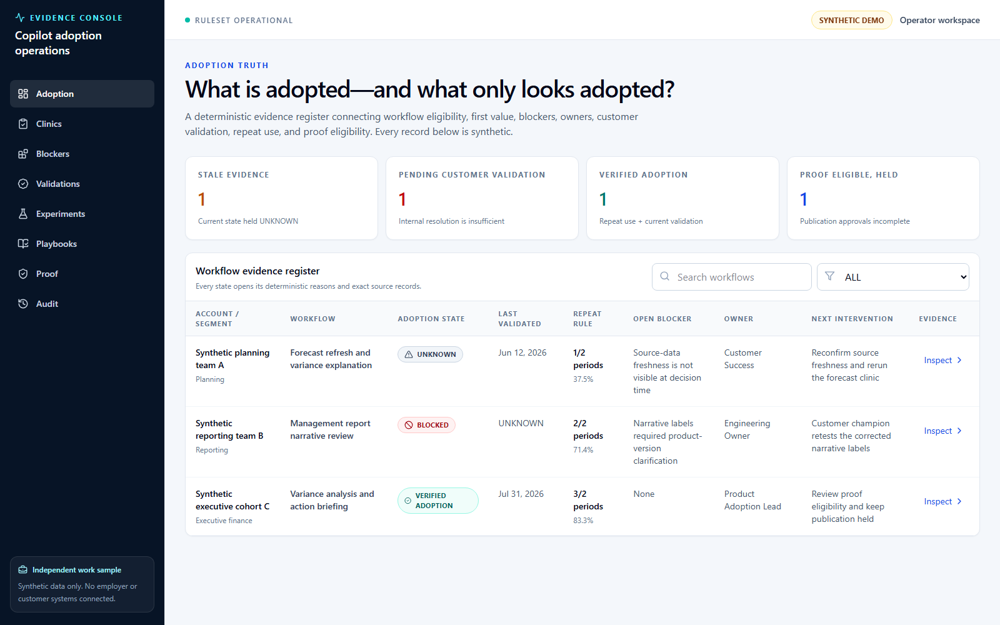
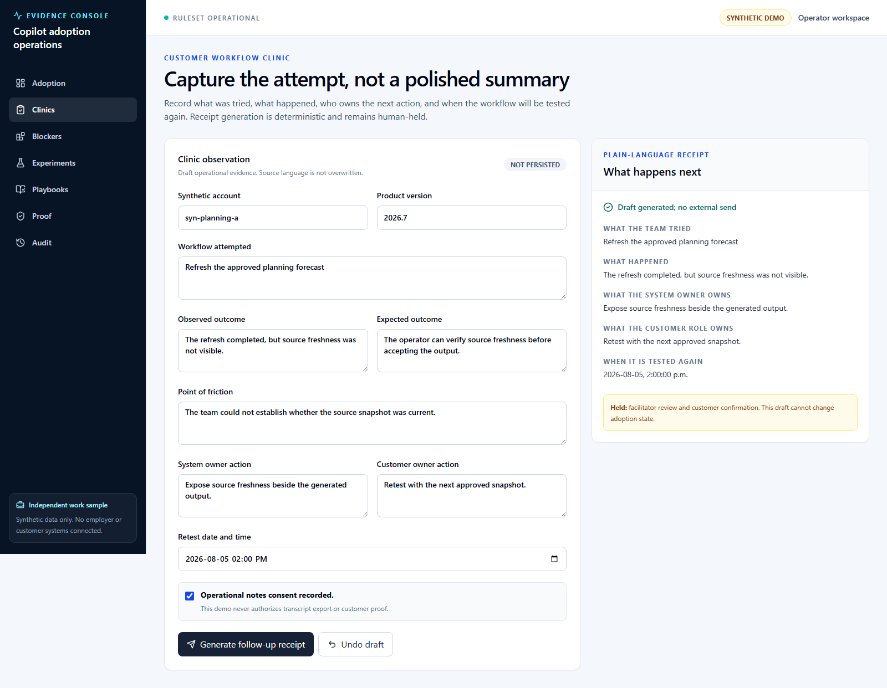
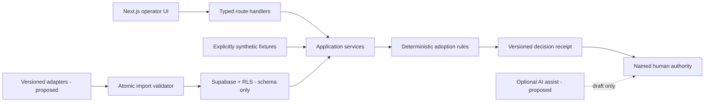

# Copilot Adoption Evidence Console

[](https://github.com/shrishmanglik/copilot-adoption-evidence-console/actions/workflows/ci.yml)

An evidence-bound operating console for teams responsible for adoption of AI-enabled workflows. It connects workflow eligibility, first value, blockers, owners, product actions, customer validation, repeat use, reusable playbooks, and proof decisions without turning missing evidence into a success state.

This is an independent, candidate-authored work sample. It is not affiliated with, endorsed by, or connected to an employer, customer, or software provider. Every account, workflow, event, and metric in the repository is explicitly synthetic.



## The problem

Product teams can measure feature activity and still fail to answer the operational question: did a customer adopt the intended workflow, on the current product version, with an owned blocker path and current human validation?

The console gives a Product Adoption Lead one traceable record from eligibility through clinic, first value, blocker, action, release, validation, repeat use, playbook, and proof. A state is held `UNKNOWN`, `BLOCKED`, or `DISPUTED` whenever the required evidence chain breaks.

## Primary users

- Product Adoption Lead: runs clinics, triages blockers, and owns the evidence review.
- Customer champion role: validates the workflow, remaining friction, and willingness to repeat.
- Product and Engineering: own acceptance criteria, investigation, changes, and release evidence.
- Customer Success: owns account context and relationship coordination.
- Privacy and Marketing reviewers: govern sensitive data and proof wording.

No role may self-approve high-risk accuracy, privacy, adoption, or customer-proof decisions.

## Real workflow implemented

1. Open the adoption register and inspect a deterministic decision receipt.
2. Trace one synthetic workflow through its exact source records and blocker contract.
3. Run a clinic and generate a plain-language follow-up receipt.
4. Draft blocker-action, customer-validation, and playbook-candidate receipts through keyboard-operable workflows.
5. Observe that every draft remains non-persisted, non-sending, and human-held.
6. Inspect metric numerators, denominators, rules, windows, and exclusions.
7. Review proof eligibility separately from publication authority.
8. Export a versioned JSON receipt with sources, held fields, scope, and caveats.

The E2E test executes this journey in Chromium and also checks the 390 px layout for page overflow.



## Architecture



- UI: Next.js 16 App Router, React 19, TypeScript, Tailwind CSS v4, and shadcn-style local primitives.
- Domain: account- and segment-scoped baseline, enablement, clinic, blocker, action, release, usage, validation, playbook, caveat, approval, receipt, metric, and import contracts.
- Service boundary: pure application services mediate between route handlers, rules, fixtures, and future adapters.
- Persistence: the running demo is fixture-backed. A forward and rollback Supabase migration defines the production contract; every created table has RLS with role- and operation-specific policies. Composite tenant keys bind parents, receipt sources, proof candidates, and every actor to organization membership. Viewers cannot write, consequential records are append-only, and approval policies bind a different requester to a signed-in role-specific approver.
- Audit: state decisions identify the ruleset, reasons, held fields, sources, time, and human authority.

See [architecture.md](./docs/architecture.md) for boundaries and failure semantics.

## Deterministic / AI / human split

| Layer                  | Authority in this repository                                                                                                                         |
| ---------------------- | ---------------------------------------------------------------------------------------------------------------------------------------------------- |
| Deterministic software | Validates freshness, product-version parity, blocker closure, observation windows, repeat-use rules, imports, metric math, and receipt completeness. |
| AI assistance          | Proposed only: summarization, clustering, question suggestions, and neutral follow-up drafts. There is no runtime AI call in this build.             |
| Human authority        | Blocker cause, sentiment, accuracy, metric definition, product acceptance, customer validation, privacy, customer proof, and publication.            |

Eight critical detectors are mutation-tested without a runtime bypass: record integrity, chronology, foundation chain, blocker/action chain, current release, current usage, repeat-use evidence, and customer validation. Disabling each detector in the test harness must fail its bound negative assertion; restoring the exact source must pass twice.

## Implemented versus proposed

### Implemented

- Responsive adoption, account, clinic, blocker, validation, experiment, playbook, proof, and audit surfaces.
- Deterministic adoption state engine with deletion-sensitive source-chain receipts and regression paths.
- Metric receipts exposing definition, source window, numerator, denominator, and exclusions.
- Atomic import validation that retains the last accepted snapshot on rejection.
- Clinic receipt API with validation, error/retry, undo, and explicit non-persistence.
- Governed blocker-action, customer-validation, and playbook-candidate receipt API with validation, retry, undo, human holds, and no external action.
- Versioned export contract with sources, held fields, scope, generation time, and caveats.
- Evidence-bound proof decisions computed from the same source records as adoption, with separate workflow validation, customer proof-use consent, metric approval, caveats, privacy, wording, and publication gates; no counter or proof gate is hard-coded.
- Supabase forward/rollback schema with least-privilege RLS checks, normalized receipt-source and proof-candidate references, tenant-bound actors, and append-only evidence, receipts, proof candidates, approvals, and audit events.
- Repository-enforced LF checkout via `.gitattributes` for Windows/Linux format reproducibility.
- Unit/contract, mutation, type, lint, build, accessibility, E2E, and mobile overflow checks.

### Proposed, not claimed

- Live Supabase persistence, authentication, SSO, provider adapters, telemetry, CRM, and support integrations.
- AI-assisted summaries or blocker clusters.
- A production tenant model, retention schedule, data residency decision, or regulatory mapping.
- Customer demand, outcomes, pricing acceptance, revenue, deployment, or employer adoption.

## Security and privacy

- No secrets or environment values are required for the synthetic demo.
- No real customer, employer, finance, prompt, transcript, or telemetry data is included.
- The production schema is tenant-scoped and enables RLS on every table.
- Audit events are append-only at the database contract level.
- Imports reject invalid rows transactionally and keep the last accepted snapshot.
- Customer proof and transcript export remain blocked without explicit consent and reviewer authority.

Live RLS effectiveness is `UNKNOWN` because no provider database is connected. Source declarations are not provider proof. See [security-privacy.md](./docs/security-privacy.md).

## Commercial hypothesis

The hypothesis is that AI product and customer teams with complex, high-trust workflows may pay for a shared adoption evidence layer when analytics, CRM, support, and product tools do not preserve the full proof chain. A plausible commercial motion is a paid team workspace plus implementation support for adapters and governance.

This is a hypothesis, not validated demand. The repository contains no customers, interviews, willingness-to-pay evidence, pricing validation, revenue, or outcome benchmarks.

## Local setup

Requirements: Node.js 20.9+ and npm.

```bash
git clone --branch dev/copilot-adoption-evidence-console-initial-build --single-branch https://github.com/shrishmanglik/copilot-adoption-evidence-console.git
cd copilot-adoption-evidence-console
npm ci
npm run dev
```

The branch is pinned because the implemented application is currently under review in PR #1; the default branch is not yet the setup target. After merge, `main` becomes the stable quickstart branch.

Open `http://localhost:3000`. No `.env` file is needed.

## Reproducible demo

```bash
npm test
npm run typecheck
npm run lint
npm run build
npm run verify:generated-clean
npm run test:mutation
npm run test:e2e
```

Current local evidence at author handoff:

- Unit/contract suite: 47/47 passed across 7 files.
- Browser suite: 2/2 passed, including keyboard-contained evidence inspection, focus restoration, all four counter drill-downs, clinic, blocker, validation, and playbook workflows, serious/critical axe scan, and 390 px overflow check.
- Mutation control: all 8 critical detectors failed their bound negative tests when disabled; restored source passed twice.
- TypeScript, ESLint, Next.js production build, and dependency audit: passed.

## Recovery and operations

- Failed import: reject the full candidate transaction and retain the accepted snapshot.
- Stale or missing evidence: preserve the last known value, but set current adoption to `UNKNOWN`.
- Product version change: invalidate prior customer validation for the affected workflow.
- Customer disagreement: show both signals and move the state to `DISPUTED`.
- Failed clinic receipt: return field-level validation, preserve the form, and allow retry or undo.
- Persistence rollout: apply the forward migration only with provider authority; use the included rollback plan if the migration gate fails.

See [operator-runbook.md](./docs/operator-runbook.md).

## Evidence boundaries

- Local source/tests can prove implementation and local behavior.
- GitHub can prove repository visibility, branch, commit, PR, and hosted checks.
- Only provider dashboards can prove deployment, live auth, live RLS, billing, payments, or environment state.
- Only customer and revenue evidence can prove demand, adoption, outcomes, or commercial success.

The [evidence manifest](./docs/evidence/evidence-manifest.json) keeps these truth classes separate.

## Roadmap

1. Independent review of the current PR; no self-review or merge.
2. Add authenticated tenant boundaries and exercise RLS against a local Supabase instance.
3. Implement one versioned read-only adapter with replayable fixtures and row-level error reporting.
4. Add approved notification and review queues without granting publication authority.
5. Validate the commercial problem through documented discovery before pricing or outcome claims.

## License

[MIT](./LICENSE). Synthetic fixtures and screenshots are included solely to demonstrate the product workflow.
